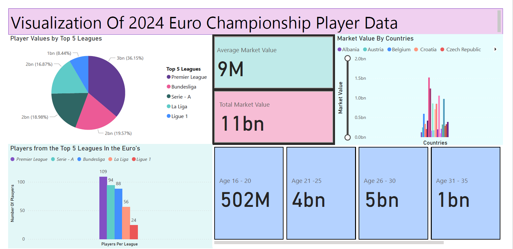

# Hi, I'm Nikhil Anil! 👋
 

## Mechanical Engineer & Data Science Student

Data-driven and analytical thinker with a background in Mechanical Engineering and a passion for uncovering insights through data. Skilled in tools like Python, SQL, and Excel, and eager to apply these in real-world analytics projects. Seeking internships or entry-level roles in data analytics to contribute to impactful, insight-driven decision-making.

📧 **Email**: itsnik836@gmail.com  
📍 **Location**: currently in Dresden, Germany but willing to relocate for opportunities.  

### 🛠️ Technical Skills

**Languages & Tools**: Python, SQL, Power BI, Excel, Microsoft Office Suite, Pandas, NumPy, Matplotlib, Jupyter Notebook

**Languages & Tools**: Python, SQL, Power BI, Excel, Microsoft Office Suite, Pandas, NumPy, Matplotlib, Jupyter Notebook

## Mechanical Engineer & Data Science Student

Data-driven and analytical thinker with a background in Mechanical Engineering and a passion for uncovering insights through data. Skilled in tools like Python, SQL, and Excel, and eager to apply these in real-world analytics projects. Seeking internships or entry-level roles in data analytics to contribute to impactful, insight-driven decision-making.

📧 **Email**: itsnik836@gmail.com  
📍 **Location**: currently in Dresden, Germany but willing to relocate for opportunities. 

---

## 📚 Education

- **M.Sc. Data Science**  
  *University of Applied Sciences Europe, Germany*  
  *08/2024 - Present*
  
- **B.Eng(Hons) Mechanical Engineering**  
  *University of Bolton (UK Affiliation)*  
  *09/2018 - 05/2021*

---

## 🚀 Projects

### 🔹 Data Analysis of Euro 2024 Player Data *(08/2024 - 09/2024)*

- Analyzed real world data from the most recent Euro2024.
- Generated insights using tools such as Excel and PowerBI that could be used by clubs, investors, and advertisers.

### 🔹 Dynamic Simulation of Disc Brake and Pad *(01/2020 - 05/2021)*
- Simulated thermal and stress responses using FEA tools to assess disc brake efficiency.

- Analyzed material properties, temperature distribution, and pressure variation to optimize performance.

- Applied engineering data interpretation techniques to guide design improvements.

---

## 💼 Work Experience

### 🔹 Host - Dubai Expo City *(COP28)* *(11/2023 - 05/2022)*
- Assisted in planning, preparation & organization of the event.
- Answered delegate questions and resolved emerging problems.
- Contact: Shameer (COP 28 Supervisor - Sustainability) - +971 58 5858695

### 🔹 Intern at Automobile Garage - Deira Central Motors *(02/2022 - 05/2022)*
- Learned about automobile mechanics through practical experience.
- Diagnosed and fixed technical issues.
- Contact: Ibrahim Yousuf - +971501295629

---

## 🛠 Skills

- Microsoft Office  
- CRM & Presentation  
- Problem Solving  
- Python (Jupyter Notebook)  
- SolidWorks  
- Creativity & Teamwork  
- Interpersonal Skills
- 

---

## 🏆 Achievements

- **IMECH-E Design Challenge** - Secured 3rd place in the IMECHE Design challenge for designing a pipe-climbing device.
- **IAS President Cup Inter-School Soccer Tournament (2017)** - Secured 3rd place.
- **Inter-School Football Clusters Runner-Up (2016)** - Secured 2nd place and qualified for nationals.

---

## 📜 Certifications

- **German Language Course** *(Udemy, 08/2021 - 05/2022)*

---

## 🚗 Valid Driving License

- Holder of a valid UAE Driver's License.

---

## 🌍 Languages

- **English** - Full Professional Proficiency
- **German** - Elementary Proficiency
- **Hindi** - Full Professional Proficiency

---

## 🎯 Interests

⚽ Football  
🥁 Drums  
📖 Reading  
🎨 Sketching  

